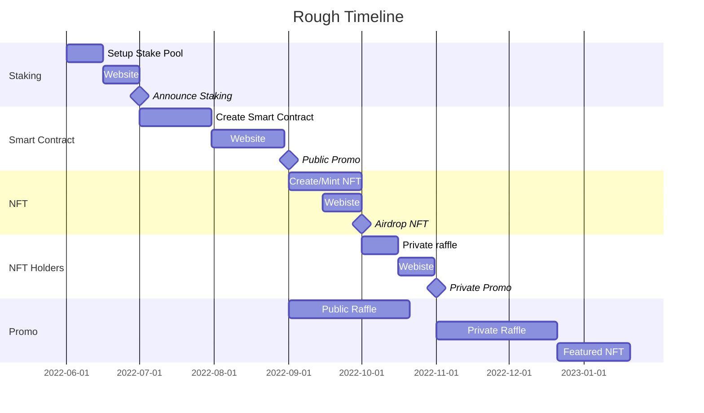

# DeRaffle

A decentralized raffle project built on Cardano blockchain.

# Roadmap

```mermaid
gantt
    title Rough Timeline
    dateFormat  YYYY-MM-DD
    
    Section Staking
	    Setup Stake Pool  : a1, 2022-06-01, 15d
	    Website  : after a1, 15d
	    Announce Staking : milestone, 2022-07-01, 0d
	    
    Section Smart Contract
	    Create Smart Contract  : b1, 2022-07-01, 30d
	    Website  : after b1, 30d
	    Public Promo : milestone, 2022-09-01, 0d

    Section NFT
	    Create/Mint NFT  : c1, 2022-09-01, 30d
	    Webiste  : c2, 2022-09-15, 16d
	    Airdrop NFT : milestone, 2022-10-01, 0d

    Section NFT Holders
	    Private raffle  : d1, 2022-10-01, 15d
	    Webiste  : after d1, 15d
	    Private Promo : milestone, 2022-11-01, 0d

    Section Promo
	    Public Raffle  : e1, 2022-09-01, 50d
	    Private Raffle  : e2, 2022-11-01, 50d
	    Featured NFT  : after e2, 30d
```
