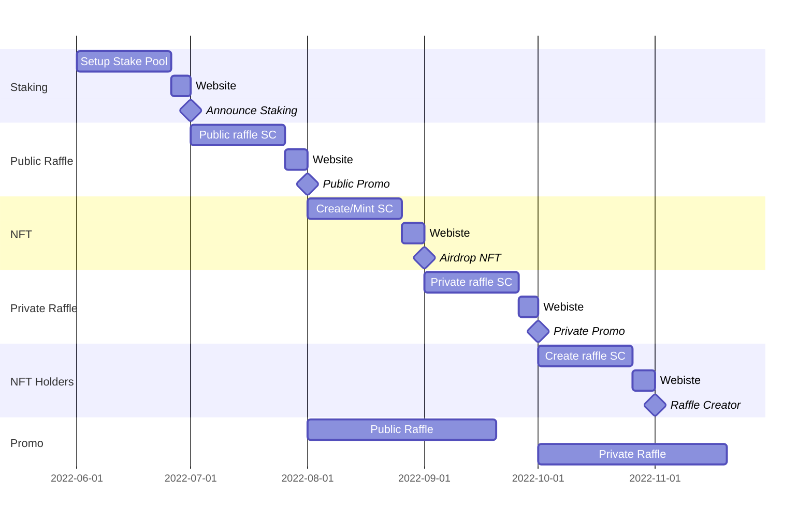

# DeRaffle Roadmap

A decentralized raffle and NFT project built on Cardano blockchain.

## Staking

* Setup stake pool with initial 1000 ADA
* Create website with roadmap and stake pool details
* Stake at least 100 ADA to get airdropped an NFT at a future date
* This is will fund the private raffles in the future

## Public Raffle

* Create smart contract for public raffle logic
* Update website to interact with contract
* Start public promo
	* Reserve 500 ADA
	* Raffle 50 ADA every epoch for 10 epoch

## NFT

* Create smart contract for minting NFT
	* To be used with the website and/or to airdrop
* Airdrop NFTs
* Update website to interact with contract

## Private Raffle

* NFT holders that are staked can participate in private raffles
* Create private raffle contract to verify
	* Staked > 100 ADA last epoch
	* NFT received before current epoch
* Update website to interact with contract
* Start private promo
	* Reserve 1000 ADA
	* Raffle 100 ADA every epoch for 10 epoch

## NFT Holders

* Ability for holders that aren't staked to create their own public/private raffles
* Update website with Public page for holders' raffles

## Ongoing

* After public promo, raffles will be by NFT holders that created public raffles, partnerships with other NFT projects, or donations
* After private promo, raffles will be created with % rewards from stake pool per epoch

# Timeline

